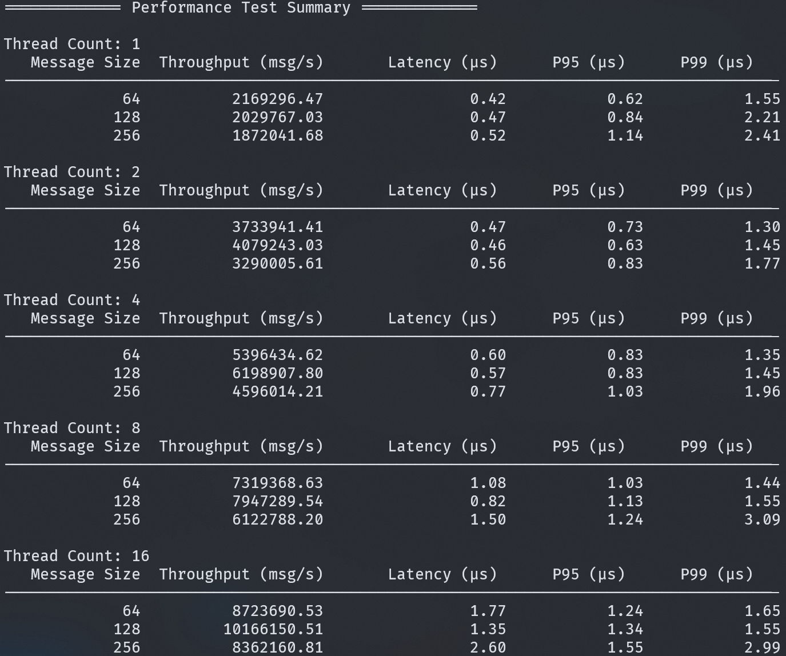

# Blitz Logger

A modern, thread-safe, and feature-rich C++ logging library designed for high performance and ease of use. Without any external dependencies, Blitz Logger is a lightweight and efficient solution for logging in C++ applications.

## Features

| Feature Category     | Description                                                                                                                     |
| -------------------- | ------------------------------------------------------------------------------------------------------------------------------- |
| Log Levels           | Supports TRACE, DEBUG, INFO, WARNING, ERROR, FATAL and STEP                                                                     |
| Asynchronous Logging | Non-blocking logging with sharded lock-free ring buffers (32 shards × 256KB = 8MB total buffer)                                 |
| File Management      | • Automatic log file rotation based on file size<br>• Configurable maximum file size and count<br>• Timestamp-based file naming |
| Flexible Output      | • Simultaneous console and file output<br>• Colored console output support<br>• Customizable output format                      |
| Rich Context         | • Timestamps<br>• Thread IDs<br>• Source location (file, line, function)<br>• Module names                                      |
| Thread Safety        | • Thread-local shard allocation<br>• Lock-free implementation<br>• Spatial locality optimization                                |
| Performance          | • Batch processing (16KB batch size)<br>• Statistics monitoring<br>• Adaptive shard selection                                   |

## Architecture

The following diagram illustrates the high-level architecture of Blitz Logger:

```
        [Thread 1]    [Thread 2]   [Thread 3]  ... (Producers)
               │             │             │
               ▼             ▼             ▼
┌─────────────────────────────────────────────────────────┐
│                  Logging Interface                      │
│  [TRACE][DEBUG][INFO][WARN][ERROR][FATAL][STEP]         │
└───────────────────────────────┬─────────────────────────┘
                                │
                                ▼
┌────────────────────────────────────────────────────────┐
│              Sharded Lock-free Ring Buffers            │
│  ┌─────────────┐ ┌─────────────┐      ┌─────────────┐  │
│  │  Shard 0    │ │  Shard 1    │ ...  │  Shard 31   │  │
│  │ [H]    [T]  │ │ [H]    [T]  │      │ [H]    [T]  │  │
│  │ [msg][msg]  │ │ [msg][msg]  │      │ [msg][msg]  │  │
│  └─────────────┘ └─────────────┘      └─────────────┘  │
└────────────────────────────────────────────────────────┘
                                │
                                ▼
                   [Background Logger Thread] (Consumer)
                                │
                      ┌─────────┴──────────┐
                      ▼                    ▼
              [Console Output]         [File Output]
                   │                       │
                   ▼                       ▼
            [Colored Output]         [Log File Rotation]
                                     /           \
                                    /             \
                           [Current Log]    [History Logs]
                                                  │
                                                  ▼
                                         [Auto Cleanup]

```

## Sample


## Performance Benchmark



## Requirements

- C++20 compatible compiler

## Usage

### Basic Example

```cpp
#include "blitz_logger.hpp"

auto main() -> int {
    // Initialize with default configuration
    Logger::initialize(Logger::Config{});

    // Log messages with different levels
    LOG_INFO("Application started");
    LOG_DEBUG("Debug information: {}", 42);
    LOG_ERROR("Something went wrong: {}", "error message");

    return EXIT_SUCCESS;
}
```

### Custom Configuration

```cpp
Logger::Config config;
config.logDir = "custom_logs";
config.filePrefix = "myapp";
config.maxFileSize = 5 * 1024 * 1024;  // 5MB
config.maxFiles = 3;
config.minLevel = Logger::Level::DEBUG;
config.useColors = true;

Logger::initialize(config);

LOG_INFO("Custom configuration applied");
```

### Module-based Logging

```cpp
void initializeDatabase() {
    Logger::getInstance()->setModuleName("DatabaseModule");
    LOG_STEP(1, "=== Database Initialization ===");
    LOG_INFO("Starting database connection...");
    // Database initialization code here
    LOG_INFO("Database connection established");
}

void initializeNetwork() {
    Logger::getInstance()->setModuleName("NetworkModule");
    LOG_STEP(2, "=== Network Initialization ===");
    LOG_INFO("Configuring network interfaces...");
    // Network initialization code here
    LOG_INFO("Network initialization complete");
}

void initializeSystem() {
    // Initialize core modules
    initializeDatabase();
    initializeNetwork();

    Logger::getInstance()->setModuleName("SystemModule");
    LOG_INFO("All modules initialized successfully");
}
```

## Configuration Options

| Option             | Description                         | Default |
| ------------------ | ----------------------------------- | ------- |
| logDir             | Log directory path                  | "logs"  |
| filePrefix         | Log file name prefix                | "app"   |
| maxFileSize        | Maximum size per log file           | 10MB    |
| maxFiles           | Maximum number of log files to keep | 5       |
| minLevel           | Minimum log level to process        | INFO    |
| consoleOutput      | Enable console output               | true    |
| fileOutput         | Enable file output                  | true    |
| useColors          | Enable colored console output       | true    |
| showTimestamp      | Show timestamp in logs              | true    |
| showThreadId       | Show thread ID in logs              | true    |
| showSourceLocation | Show source file and line           | true    |
| showModuleName     | Show module name in logs            | true    |
| showFullPath       | Show full file path in logs         | false   |

## Future Work

- [x] Lockfree queue for reducing contention
- [ ] Support more output objects(Network, Database, etc)
- [ ] Support compression for log files
- [ ] Optimize memory allocation
- [ ] Add more unit tests

## License

MIT License

## Contributing

Contributions are welcome! Please feel free to submit pull requests.
